- # Fchrome
    - `Fchrome`是一款对chromium源码进行定制的浏览器,支持爬虫/JS逆向工程师进行辅助分析网页 
      - 主要功能
        - 1.~~浏览器指纹随机~~
          - 考虑法律风险 已经弃用 不再更新
        - 2.浏览器自吐模块
          - 功能
            - 监控js代码调用环境的过程
            - 分析调用日志，配合沙箱（类似nodejs本地补环境调用）进行快速补环境，不走错误分支
            - 最终实现黑盒调用算法
    - ## ~~浏览器随机指纹模块(没有给出编译后的成品)~~
        - ### 实现功能：
        ```
        gpu信息随机
        webgl图像指纹随机
        canvas画布指纹随机
        音频指纹随机随机
        canvas字体指纹随机
        css字体指纹随机
        屏幕分辨率随机
        elements大小随机
        ```
        - ### 效果
            
            - 测试网站 
                - https://gongjux.com/fingerprint/
        - ### 源码
            - 修改的源代码在finger_change_code文件夹下
            - 修改的代码上面有`// add `的注释
        - ### ~~安装包~~
            - Win版本
                - ~~http://www.dtasecurity.cn:20080/chrome.win.7z~~
                - 安装方法：
                    - 使用7z解压文件，在文件夹下打开chrome.exe即可使用
            - Linux版本
                - ~~http://www.dtasecurity.cn:20080/chromium-browser-unstable_103.0.5045.0-1_amd64.deb~~
                - 安装方法
                    - 在ubuntu命令行中输入 
                        - sudo dpkg -i chromium-browser-unstable_103.0.5045.0-1_amd64.deb
                    - 然后在软件中或者命令行下即可打开浏览器
    - ## 浏览器环境自吐模块
        - ### 实现功能(后续会增加更多的对象监控)
        - #### 对象监控
        ```
        window
        self
        top
        parent
        navigator
        document
        location
        history
        screen
        localStorage
        sessionStorage
        performance
        indexedDB
        crypto
        ```
        - #### 插件配置页面展示
          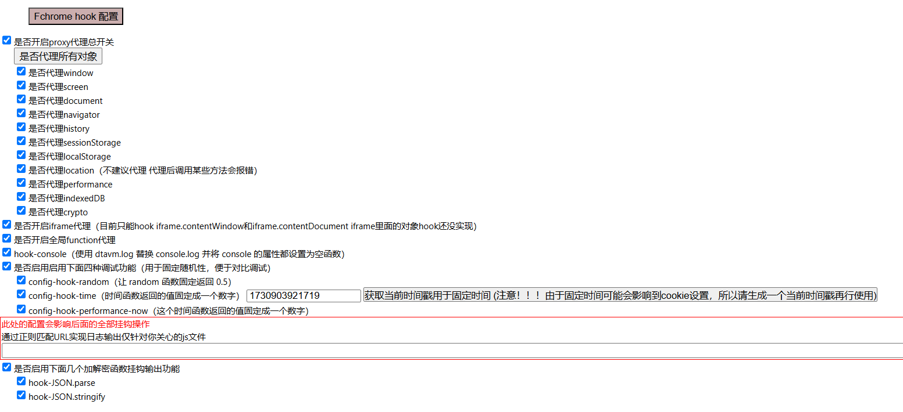 
        - #### 全局函数监控(实验中)
          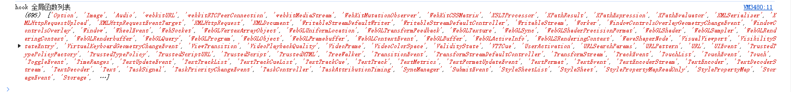
        - ### 原理简介
            - 对chromium源码中全局对象定义进行修改/添加，使得全局对象变得可以覆盖，从而使用JS的代理器对全局对象进行监控
            - 对debugger关键字替换为debuggee 无视无限debugger
        - ### 源码
            - diff文件在monitor_change_code文件夹下
        - ### 使用方法1(推荐方法2为一键启动)
          - 在浏览器控制台中执行proxy.js的代码(推荐在JS最先执行的时机断点（事件侦听器断点->脚本->脚本的第一条语句）然后运行js代码，最先取得全局对象的控制权)
          - 然后在网页上正常操作即可在控制台得到打印的对象信息，进行环境监控，辅助JS补环境
        - #### 图片教学
          - 先设置断点 然后刷新网页 即可在JS最先执行的时机停下(需要注意安装油猴后，会对此方法产生影响导致proxy.js脚本不生效)
            
          - 执行proxy.js后取消断点 然后执行网页js
            
          - 成功监控对象
            
        - ### 使用方法2
          - 导入插件到chrome
            - 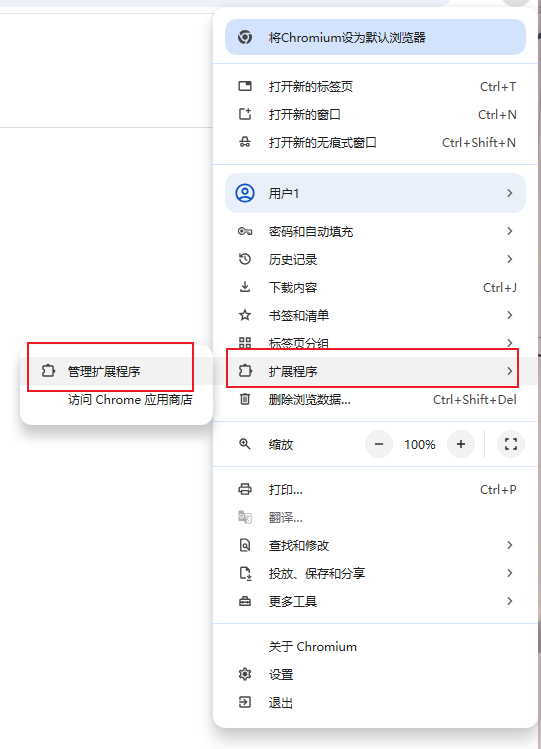
            - 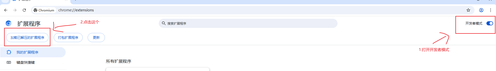
          - 下载项目 导入extension文件夹
            - 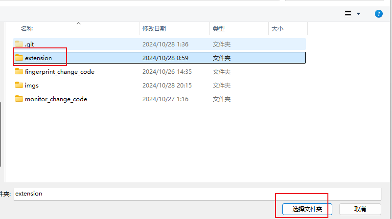
          - 导入插件成功
            - 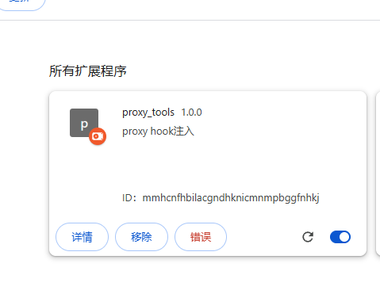
          - 启动插件
            - 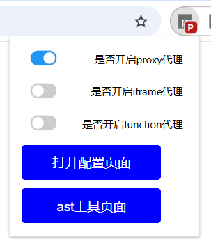 
          - 监控成功
            - 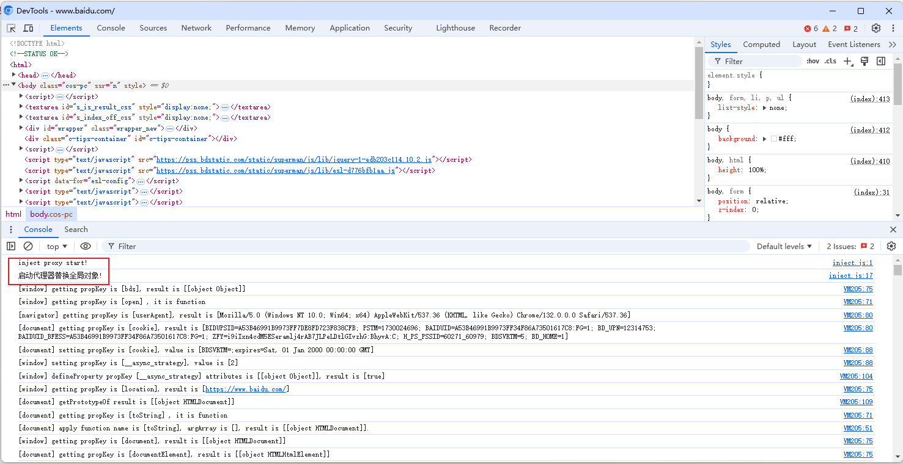 
        - ### 关于iframe中的对象代理
          - 通过插件即可监控多个iframe(还没有对iframe内的window代理只对top中的contentWindow和countDocument代理)
            - 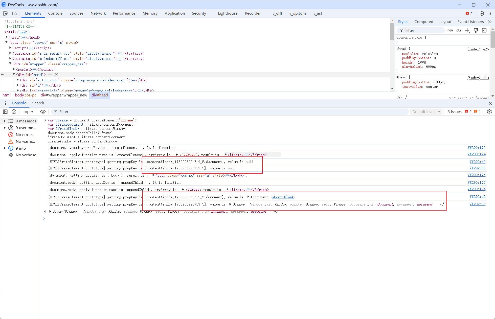
            - 
        - #### 插件启动iframe代理
            - 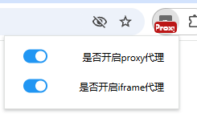
        - #### 插件启动全局函数代理（实验中）
          - 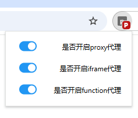
          - 
          - 效果展示
            - 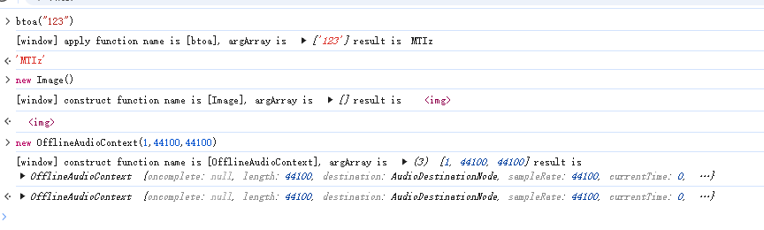
        - #### 插件一键导出调用环境 (实验中)
          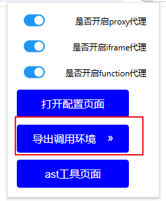
          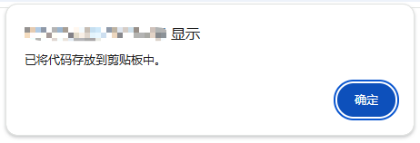
          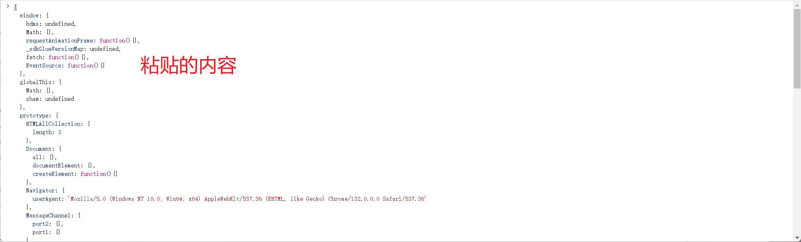 
        - ### 编译成品
            - [目前只有Win版本](https://github.com/daisixuan/Fchrome/releases)
                - 便携式
                    - 解压7z文件打开chrome.exe即可使用
                - 安装包
                    - mini_installer.exe 直接安装(适用于有管理员权限的电脑)
        - ### Tips
            - 碰到报错的方法或无法打印的对象(报错的) 手动在/extension/tools/proxy.js代码中进行过滤
            - 如果需要手动注入时:安装油猴会导致上述最早注入的时机不好找，因为会先加载油猴的环境并没有进入到目标代码跑的环境
            - 手动注入的proxy.js没有更新 最好使用插件进行hook 如果无法满足最早时机 请手动更新一下
            - 结合 https://github.com/cilame/v_jstools 中的对象原型链getset hook 一起分析会有奇效 可以同时安装使用2个插件
        
        - ### 建议
          - 遇到报错和bug可以提Issues 看到会回复解决

- # 后续更新方向
  - todo
    - ~~js hook的代码制作成chrome插件一键启动！~~
    - ~~直接内置v_jstools的监控避免冲突~~
    - 一键导出调用的环境 一键补环境 (耗时较久) 目前实现对象方式输出 还未加入原型链方式
    - 自定义console.log 并去掉原始的console.log 防止控制台/cdp检测 和 console.log被抹去或被console.clear清掉日志（目前通过js hook方式去实现 暂不更新）
    - 更新其他全局对象监控

- # 联系作者&&商务合作
  - ## wx: lenganlan

- # 感谢支持!!

